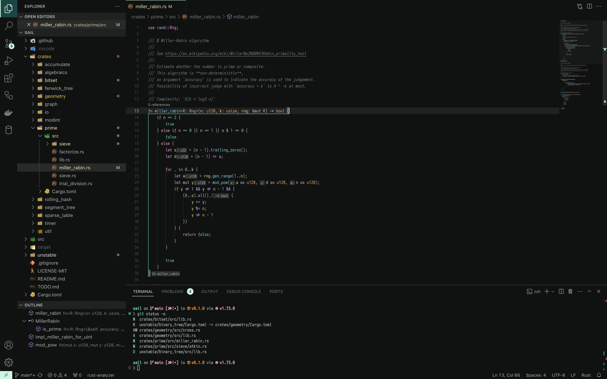
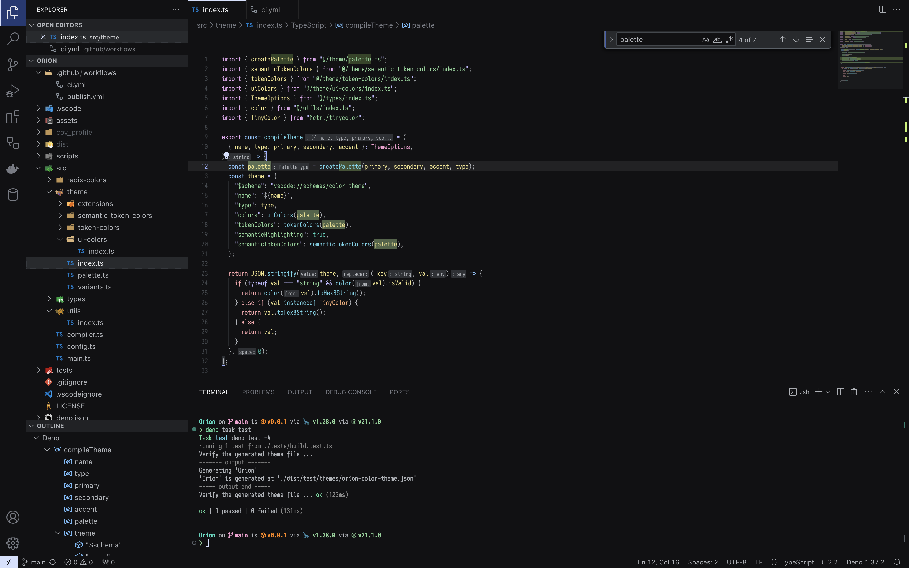
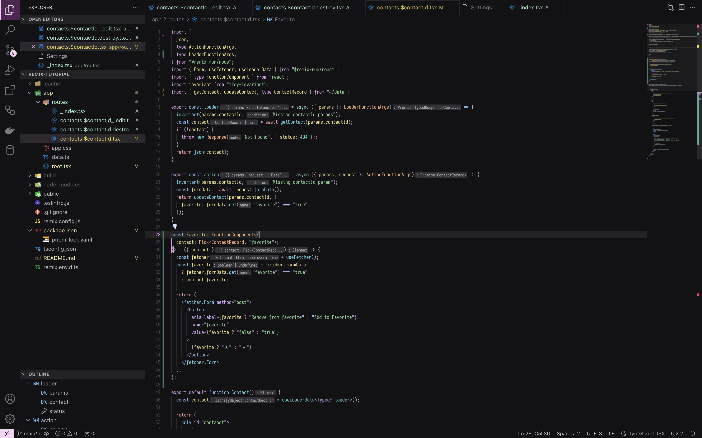

# Orion Theme

A customizable vscode theme, built on `Deno` and `Radix Colors`.

## Gallery

### Rust (mint)



### TypeScript (indigo)



### TypeScript React (plum)



## Design Philosophy

1. Every color should be used purposively.
2. Flat UI make its space look larger.
3. Richer syntax highlight color is better.
4. Should be customizable.

## Installation

### From VSCode Marketplace

Install from [https://marketplace.visualstudio.com/items?itemName=SaiYs.orion-vscode]

### From source

1. Clone the repository

   ```sh
   gh repo clone SaiYs/Orion
   ```

2. Build the extension

   ```sh
   deno task build
   ```

   Then, `orion.vsix` is generated in the project's root.

3. Install the VSIX file

   ```sh
   code --install-extension orion.vsix
   ```

   Alternatively, you can also choose `Extensions: Install from VSIX...` from
   command palette in VSCode, and select `orion.vsix` to install.

## Preference

### `orion-vscode.accentColor`

Pick your favorite color from the colorful palette by `Radix Colors`.

(default: "indigo")

### `orion-vscode.neutralGray`

By default, saturated grayscale colors from `Radix Colors` are used. If you
prefer desaturated grayscale colors, you can disable it and use neutral gray
colors.

(default: false)

## Language support

- Rust
- JavaScript
- TypeScript
- JavaScript React
- TypeScript React
- HTML
- CSS
- JSON
- TOML
- YAML
- Markdown

You don't find your languages?
Please make a issue or PR!

## Inspirated by

Orion is made from lots of inspiration by others' themes. Thanks for great
works.

- [Night Wolf](https://github.com/mao-santaella-rs/NightWolfTheme)
- [Catppuccin](https://github.com/catppuccin/vscode)
- [One Hunter Theme](https://github.com/Railly/one-hunter-vscode)
